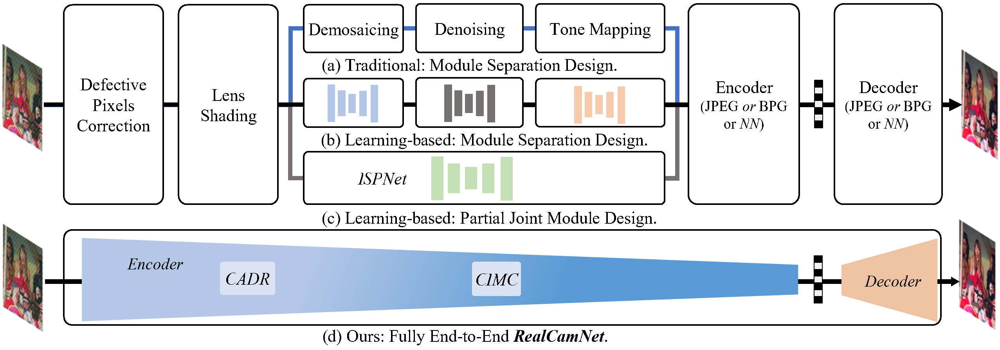
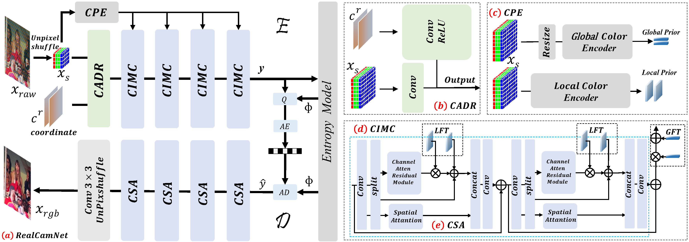
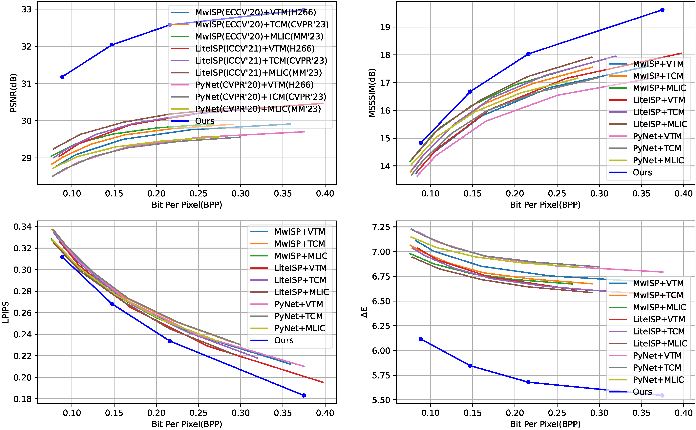

<h1>An End-to-End Real-World Camera Imaging Pipeline</h1>

    <a href='https://kepengxu.github.io/' target='_blank'>Kepeng Xu</a>&emsp;
    <a href='' target='_blank'>Zijia Ma</a>&emsp;
    <a href='https://icecherylxuli.github.io/' target='_blank'>Li Xu</a>&emsp;
    <a href='' target='_blank'>Gang He et al</a>

    Xidian University, Southwest University of Science and Technology&emsp; 

    <strong>ACMMM 2024</strong>

    <h4 align="center">
        
    </h4>

  
   
  Graph Abstract
   

  
   
    Network Architecture
   

  
   
  🔥 For more results, visit our <a href="https://kepengxu.github.io/projects/realcamnet/"><strong>project page</strong></a>. 🔥
   
  ⭐ If you found this project helpful to your projects, please help star this repo. Thanks! 🤗

# Update
- **2024.07**: This repo is created!

# Getting Started

## Dependencies and Installation

required packages in `requirements`
